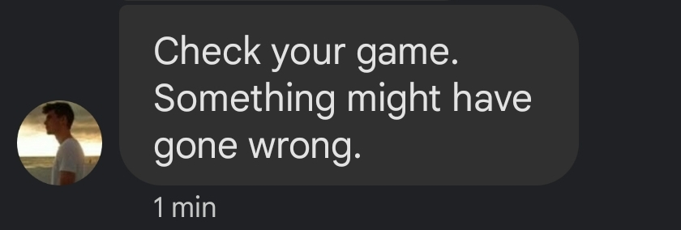

# Goliath
### Using computer vision to determine if car is still driving in Forza Horizon 5

In Forza Horizon 5, rewards are given for completed races. The reward varies depending on the difficulty and the type of race. Wanting to maximize rewards with the least amount of effort, this script aims to let users run a long race away from the keyboard or controller. Start a race that could take 7 hours, start the script, and do something else! If anything goes wrong or if you finish the race, you'll get a text message notifying you to check the game. 

---
## Set Up

1. Log into your Gmail account
2. Click on your account
3. Click on "Manage your Google Account"
4. Under Security -> Signing in to Google click on "App passwords"
5. Generate a password by filling out the form
6. Copy the password (you won't be able to see it again)
7. At the bottom of goliath.py enter your email, the app password you just received, and your number followed by your carrier

Carrier information will be one of the following:
**Att:** @mms.att.net
**Tmobile:** @tmomail.net
**Verizon:** @vtext.com
**Sprint:** @messaging.sprintpcs.com
**Virgin:** @vmobl.com
**Boost:** @smsmyboostmobile.com
**Cricket:** @sms.cricketwireless.net
**Metro:** @mymetropcs.com
**US Cellular:** @email.uscc.net
**Xfinity:** @vtext.com

*Consider using environment variables if you don't want to hard code this information*

---
## Usage

With the script set up, we can now boot Forza Horizon 5. Before entering a race and running the script, we need to enable the game's auto-driving features.

1. Go into **Settings -> Difficulty**
2. Change **Drivatar difficulty to New Racer**
3. Change the **Braking to Assisted**
4. Change the **Steering to Auto-steering**
5. Save the settings and exit the menu
6. Run the script
7. Start a race
8. Keep the acceleration button or key pressed
9. Leave and await a text saying to check back

*Note: leave yourself enough time to run the script and return to the race. If the script captures an image before the race starts/the car is moving you will have to restart the script.*
